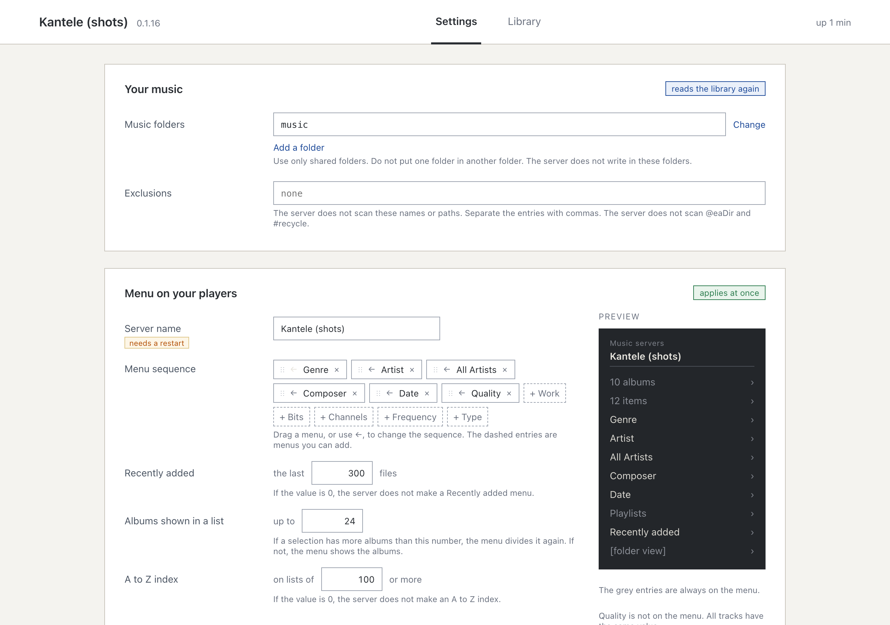

# Kantele

A music server for your amplifier, streamer or phone. Point it at the folder your music is in, and
every UPnP/DLNA player on your network can browse the library by album, artist, genre, composer or
year, search it, and play it.

It is made for a Synology NAS, and runs on a Mac or a Linux machine just as well. It is free, open
source, and makes no request to the internet.

## What you get

- **Your albums as you tagged them.** One album per folder, the discs of one album joined when the
  tags or the folder names say so, compilations kept together, and `Various Artists` never listed
  as an artist.
- **Menus that narrow.** Open a genre and you are offered its artists, then their albums. A choice
  that would not narrow anything is left out. You choose which menus appear and in what order.
- **Quick to find things.** An `A-Z` entry at the top of a long list, `Recently added`, your
  playlists, a folder view for when the tags are not enough, and the search box of your player.
- **Every format it finds, as it is.** FLAC, ALAC and AAC, MP3, Ogg Vorbis and Opus, WAV, AIFF,
  WavPack, Monkey's Audio, and DSD in DSF and DFF. Nothing is converted, so what plays is the file.
- **New music appears on its own.**
- **A page to set it up**, and to see what each folder holds and which files have a problem.

It does not convert formats, play video or radio, or reach a streaming service.

## Install

**Synology.** In Package Center, add this package source under **Settings**, **Package Sources**:

    https://gaelsimon.github.io/kantele/index.json

Then install Kantele, give it read access to your music share, and choose the folder.
[Getting started](docs/getting-started.md) walks through the three steps.

**macOS and Linux.** Download the archive for your machine from the
[latest release](https://github.com/gaelsimon/kantele/releases/latest), and run `./install.sh`
inside it (`sudo ./install.sh` on Linux). Then open <http://localhost:8200/config> and choose the
folder.

## The page

Open Kantele from the DSM menu, or `http://<your server>:8200/config`.

**Settings** is where you choose the music folder and the menus your players show. Each setting says
when a change takes effect.

**Library** shows your music folder by folder: how many albums and tracks each holds, what the tags
made of it, and which files could not be read. Click a count to see the files behind it.

## Documentation

**Start here:** [Getting started](docs/getting-started.md), from installing to playing a first
album.

**How to:** [fix a problem](docs/troubleshooting.md), [move from
MinimServer](docs/coming-from-minimserver.md), [report your
player](docs/players.md#report-your-player).

**Reference:** [settings](docs/settings.md), [the tags Kantele
reads](docs/tagging.md#the-tags-it-reads), [players in use](docs/players.md).

**How it works:** [your library on your player](docs/on-your-player.md), [how albums, discs and
artists are formed](docs/tagging.md).

To build it or work on it, see [CONTRIBUTING.md](CONTRIBUTING.md).

## Licence

GPL-3.0-only. See `LICENSE`.
