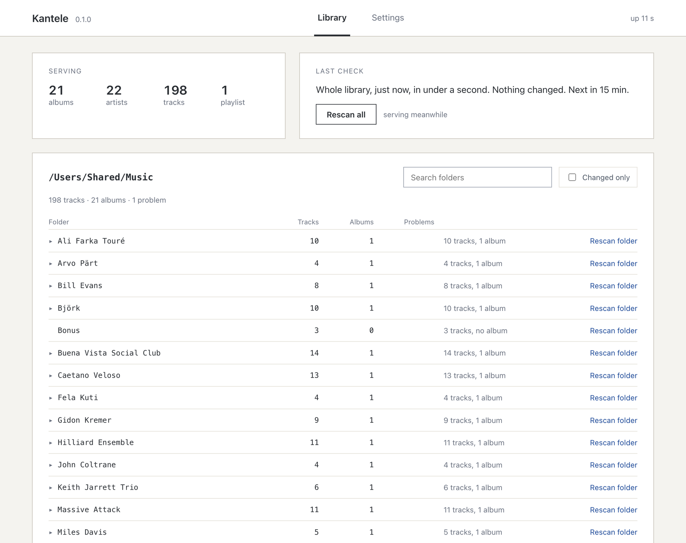

# Kantele

A UPnP/DLNA music server for the amplifier in the listening room. It serves a music folder to any
control point, remembers the library between starts, and looks for new music on a timer.

It is written for a NAS with two slow cores and a library of tens of thousands of files, browsed
over the network by a streamer or an amplifier. One static binary on one port, with no runtime to
install.

## What it does

- Albums, artists, playlists, recently added and a folder view, plus menus along the axes you turn
  on: genre, artist, all artists, composer, work and date, or the file's own quality, bit depth,
  channels, frequency and type. A long list carries an `A-Z` index.
- `Search`, which is what the search box on an amplifier sends, answered for every property a
  typed name can reach.
- Playlists: `.m3u`, `.m3u8` and `.pls`, played in the order the file writes.
- Byte ranges, so a renderer can seek, with the DLNA headers that say so.
- Eventing, so a control point is told when the library changed.
- A saved index, so a restart serves the library before the walk finishes.
- A settings and status page on the same port, described below.

It does not transcode, cast, play video, or reach a streaming service, and it makes no request to
the internet at all.

## Installing

Nothing is tagged yet, so the packages the first two sections describe are not downloadable. Until
a release exists, build it from source.

### Synology

Take the `.spk` for your architecture from the release and install it in Package Center under
**Manual Install**. The package is not signed, so Package Center's trust level has to allow any
publisher.

Two things the installer cannot do for you:

- Give the package read access to your music share. The server runs as the `kantele` package user,
  and in Control Panel you grant that user read access on the shared folder. Without it every
  folder comes back empty.
- Choose the folder. The package starts with none, so open Kantele from the DSM menu, which lands
  on Settings, and pick it there.

### macOS

Open the release and run the installer inside it:

    ./install.sh

It puts the binary in `~/.local/bin`, the configuration and the index in
`~/Library/Application Support/Kantele`, and a launch agent that starts the server at login. The
binary is not signed or notarised, so macOS would otherwise refuse it; the installer clears the
quarantine flag. Open <http://localhost:8200/config> to choose a music folder. macOS asks once
whether to let it accept incoming connections, and discovery does not work if that is refused.

### From source

    cargo build --release

A stable Rust toolchain is all it needs. The configuration page is committed as a built file, so a
clone builds and tests with no node installed.

## Config page

At `/config`, on the same port as the music.

**Library** is the folder tree. Per folder it shows how many tracks and albums it holds, what is
wrong with it, and how many tracks carry no artist, date, genre or cover art. Every count opens
onto the files behind it.

It also lists every address the server has heard from and how far each got: searching, browsing,
playing.

**Settings** writes the keys a page can write, and says what each one costs to change, from applied
at once to needing a restart.

There is no password. A write changes a menu setting or starts a check of the library, and every
device on the network can already browse and stream all of it, so the firewall is what protects the
port. DSM's own holds it to the LAN.

The page reads a plain-text interface on the same port, and so can a shell with no `jq`:

    curl -s localhost:8200/api/status
    curl -s -X POST localhost:8200/api/rescan

## Config file

Everything is in one TOML file, and `kantele.example.toml` documents every key beside its default.
The page writes the ones that can be written; the rest say where their value came from.

Precedence is the file, then the environment, then the command line. A key nobody recognises stops
the server, so a typo is a message at startup instead of a setting that never applied.

`kantele --help` lists the options and the environment variables.

## Control points and renderers

A control point browses and chooses; a renderer plays. These pairs are the ones in daily use here.

| Control point | Playing to |
|---|---|
| Yamaha MusicCast | Yamaha `TSX-N237D` |
| Denon HEOS (Android) | Marantz `Model 40N` |
| [Neos](https://github.com/gaelsimon/neos-audio) | Marantz `Model 40N` |
| BubbleUPnP (Android) | the Android device itself |

Each of them finds the server, browses it, searches it and plays from it.

If you point something at it, open an issue saying what the two ends were and what the log said.
Every request is traced there with the user agent that sent it.

## Tests

    cargo test        # the crate and the gates
    cd web && npm test

`wire_snapshots.rs` freezes every document that goes on the wire, because a reordered element
compiles and passes everything else. Read its diff before accepting it. `CONTRIBUTING.md` has
the rest.

`tests/the_binary_answers_over_a_real_socket.rs` starts the built binary and asks it over TCP. It
advertises itself over SSDP like any other server while it runs, so devices on your network will
find it for the few seconds it lives.

## Documentation

| Document | What it covers |
|---|---|
| [First run](docs/first-run.md) | Choosing a folder, what the first check costs, how new music appears |
| [Settings](docs/settings.md) | What each one means to a listener, and what changing it costs |
| [Troubleshooting](docs/troubleshooting.md) | No device finds it, empty menus, a split album, where the log is |

`kantele.example.toml` is the reference for every key.

## Licence

GPL-3.0-only. See `LICENSE`.
